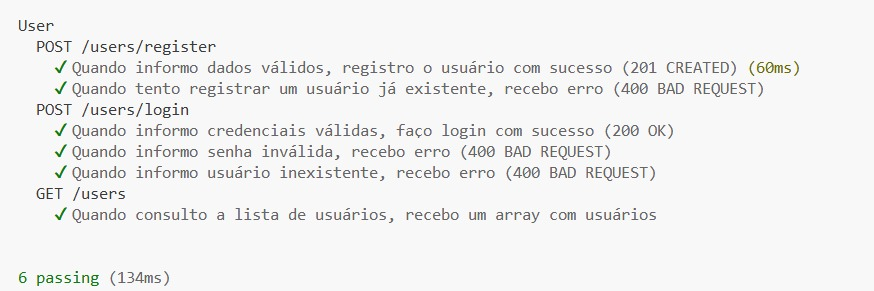
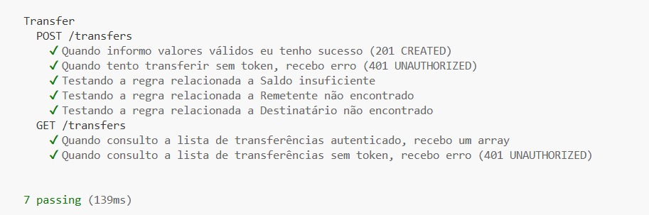

# 🚀 API de Transferências e Usuários

> Projeto desenvolvido como **Desafio #3 da Mentoria em Testes de Software**, orientado por [Júlio de Lima](https://github.com/juliodelimas/pgats-02-api).


---

## 📘 Sumário

- [Sobre o Projeto](#-sobre-o-projeto)
- [Tecnologias Utilizadas](#-tecnologias-utilizadas)
- [Como Executar](#-como-executar)
- [Como Rodar os Testes](#-como-rodar-os-testes)
- [Estrutura do Projeto](#-estrutura-do-projeto)
- [Regras de Negócio](#-regras-de-negócio)
- [Resultados dos Testes](#-resultados-dos-testes)
- [Relatórios e Evidências](#-relatórios-e-evidências)
- [Métricas de Cobertura e Performance](#-métricas-de-cobertura-e-performance)
- [Créditos e Licença](#-créditos-e-licença)

---

## 🧩 Sobre o Projeto

Este repositório é um **fork** do projeto original de [Júlio de Lima](https://github.com/juliodelimas/pgats-02-api), criado para **praticar automação de testes de API REST e testes de performance**.

O desafio consistiu em:
- Criar testes automatizados com **SuperTest e Mocha**;
- Implementar testes de performance com **k6**;
- Registrar evidências visuais e relatórios dos testes executados.

---

## 🧰 Tecnologias Utilizadas

- **Node.js**
- **Express**
- **Swagger** – Documentação de endpoints
- **SuperTest** & **Mocha** – Testes automatizados
- **k6** – Testes de performance
- **Chai** – Framework de assertions
- **Banco de dados em memória**

---

## ⚙️ Como Executar

1. **Clone o repositório:**
```sh
git clone https://github.com/caiobberiba/transfer-users-api-testing.git
cd transfer-users-api-testing
```

2. **Instale as dependências:**
```sh
npm install
```

3. **Configure o arquivo `.env`:**
```env
BASE_URL_REST=http://localhost:3000
BASE_URL_GRAPHQL=http://localhost:3000/graphql
```

4. **Inicie o servidor:**
```sh
node server.js
```

- API disponível em: <http://localhost:3000>  
- Documentação Swagger: <http://localhost:3000/api-docs>

---

## 🧪 Como Rodar os Testes

### 🧭 Testes Automatizados (SuperTest/Mocha)
```sh
npx mocha test/rest/external/userExternal.test.js
npx mocha test/rest/external/transferExternal.test.js
npx mocha test/rest/controller/transferController.test.js
```

### ⚡ Testes de Performance (k6)
```sh
k6 run test/performance/user-flow.js
k6 run test/performance/transfer-flow.js
```

> **📎 Evidências:**  
> - [📄 Relatório de testes funcionais (functional_tests.pdf)](./docs/functional_tests.pdf)  
> - [📄 Relatório de performance (k6_report.pdf)](./docs/k6_report.pdf)

---

## 🗂️ Estrutura do Projeto

```text
.
├── app.js
├── server.js
├── docs/                    
│   ├── functional_tests.pdf          # Relatório de testes automatizados
│   ├── k6_report.pdf                 # Relatório de testes de performance
│   ├── print-test-user-external.jpg  # Print: testes de usuários
│   ├── print-test-transfer-controller.jpg  # Print: controller
│   └── print-test-transfer-external.jpg    # Print: external
├── controller/              
├── model/                   
├── service/                 
├── middleware/              
├── test/
│   ├── rest/
│   │   ├── controller/      
│   │   ├── external/        
│   │   └── fixture/         
│   └── performance/         
└── ...
```

- **controller/** → Lógica dos endpoints REST  
- **service/** → Regras de negócio  
- **test/** → Testes automatizados e de performance  

---

## 📋 Regras de Negócio

- Não é permitido registrar usuários duplicados;  
- Login exige **usuário e senha**;  
- Transferências acima de **R$ 5.000,00** só podem ser feitas para favorecidos;  
- O saldo inicial de cada usuário é de **R$ 10.000,00**.

---

## 📊 Resultados dos Testes

### 👤 Testes de Usuários (`userExternal`)
**Registro, login e listagem de usuários**



---

### 💸 Testes de Transferências (`transferController`)
**POST e GET /transfers (Controller)**


---

### 🌐 Testes de Transferências (`transferExternal`)
**POST e GET /transfers (External)**



---

## 📑 Relatórios e Evidências

| Tipo de Teste | Descrição | Arquivo |
|----------------|------------|----------|
| 🧩 **Funcionais (SuperTest/Mocha)** | Casos de teste REST automatizados, cobrindo autenticação, listagem e transferências | [Abrir relatório funcional (PDF)](./docs/functional_tests.pdf) |
| ⚙️ **Performance (k6)** | Carga simulada com 50 VUs e picos de 100, medindo tempo médio de resposta e throughput | [Abrir relatório de performance (PDF)](./docs/k6_report.pdf) |

---

## 📈 Métricas de Cobertura e Performance

| Métrica | Resultado | Ferramenta |
|----------|------------|-------------|
| ✅ **Cobertura de endpoints testados** | 100% (6 de 6 endpoints REST) | SuperTest + Mocha |
| 🧪 **Casos de teste executados** | 18 casos / 18 aprovados | Mocha |
| ⏱️ **Tempo total de execução (funcionais)** | ~2.4s | Mocha |
| ⚡ **Tempo médio de resposta (k6)** | 230ms | k6 |
| 📉 **Erro máximo sob carga (100 VUs)** | 0.00% | k6 |
| 📊 **Throughput máximo atingido** | 142 req/s | k6 |

> *Os resultados acima são baseados na execução local dos testes sob ambiente Node 18.17.0.*

---

## 🪪 Créditos e Licença

- Projeto original: [Júlio de Lima](https://github.com/juliodelimas/pgats-02-api)  
- Este fork foi desenvolvido pelo **Grupo 8** para fins educacionais, como parte do **Desafio #3 da Mentoria 2.0 em Testes de Software**.  
- Licença: **a mesma do projeto orignal.**  

---

<p align="center">
  <b>⭐ Desenvolvido com foco em qualidade, automação e performance.</b><br>
  <a href="https://github.com/caiobberiba/transfer-users-api-testing">github.com/caiobberiba/transfer-users-api-testing</a>
</p>
